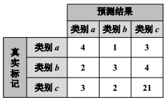

### 代价敏感学习简介

***

【参考资料】

魏秀参	《解析卷积神经网络——深度学习实践手册》

周志华	《机器学习》

代价敏感学习（cost-sensitive learning）研究非均等代价下的学习，是解决类别不平衡问题的重要方法之一。

#### 1. 代价敏感方法

代价敏感方法可概括为两种，一则基于代价敏感矩阵，另一则是基于代价敏感向量的方法。

##### 1.1 基于代价敏感矩阵的方法

以分类问题为例，假设某训练集共$N$个样本，形如$\left\{ \boldsymbol { x } _ { n } , y _ { n } \right\} _ { n = 1 } ^ { N }$，其中样本标记$y$隶属于$K$类。基于代价敏感矩阵方法是利用$K \times K$的矩阵$C$对不同样本类别施加错分惩罚（亦可称为权重）：
$$
\boldsymbol { C } = \left[ \begin{array} { c c c c } { C ( 1,1 ) } & { C ( 1,2 ) } & { \dots } & { C ( 1 , K ) } \\ { C ( 2,1 ) } & { C ( 2,2 ) } & { \dots } & { C ( 2 , K ) } \\ { \vdots } & { \vdots } & { \ddots } & { \vdots } \\ { C ( K , 1 ) } & { C ( K , 2 ) } & { \dots } & { C ( K , K ) } \end{array} \right]
$$
其中，$C \left( y _ { i } , y _ { j } \right) \in [ 0 , \infty )$表示类别$y _ { i }$错分为类别$y _ { j }$的“惩罚”或“代价”，其取值不小于0；且$C \left( y _ { i } , y _ { i } \right) = 0$，对应分类正确的情况。施加代价后的训练目标变为：训练得到某分类器$g$使得期望代价之和$\sum _ { n } C \left( y _ { n } , g \left( \boldsymbol { x } _ { n } \right) \right)$最小。可以发现，式（1.1）中的代价敏感矩阵反映的是类别级别的错分惩罚。

##### 1.2 基于代价敏感向量的方法

另一种代价敏感的反映方式则针对样本级别：对某样本$\left( \boldsymbol { x } _ { n } , y _ { n } \right)$，有对应的一个$K$维代价敏感向量$c _ { n } \in [ 0 , \infty ) ^ { K }$，其中$\boldsymbol { c } _ { \boldsymbol { n } }$的第$k$维表示该样本被错分为第$k$类的惩罚，自然其第$y _ { n }$维应为0。基于代价敏感向量的方法在模型训练阶段是将样本级别的代价敏感向量与样本以$\left( \boldsymbol { x } _ { n } , y _ { n } , \boldsymbol { c } _ { n } \right)$三元组形式为一同作为输入数据送入学习算法。代价敏感矩阵法实际上是代价敏感向量法的一种特殊形式，即对于某类的所有样本其错分惩罚向量为同一向量。

#### 2. 权重指定方式

通过以上描述可发现，代价敏感方法处理不平衡样本问题的前提是需事先指定代价敏感矩阵或向量，其中关键是错分惩罚或错分权重的设定。实际使用中可根据样本比例、分类结果的混淆矩阵等信息指定代价敏感矩阵或向量中错分权重的具体取值。

##### 2.1 按照样本比例指定

在此以代价敏感矩阵为例说明如何按照样本比例信息指定矩阵取值。假设训练样本标记共类：a类、b类和c类，它们的样本数目比例为3：2：1。则代价敏感矩阵可指定为：
$$
C = \left[ \begin{array} { c c c } { 0 } & { \frac { 2 } { 3 } } & { \frac { 1 } { 3 } } \\ { \frac { 3 } { 2 } } & { 0 } & { \frac { 1 } { 2 } } \\ { 3 } & { 2 } & { 0 } \end{array} \right]
$$
具体来讲，当a类样本被错分为b类（c类）时，由于其样本数较多，对应惩罚权重可设为稍小值，即b类（c类）样本数与a类样本数的比值$\frac { 2 } { 3 } \left( \frac { 1 } { 3 } \right)$；当b类样本被错分为a类（c类）时，对应惩罚权重同样为a类（c类）样本数与b类样本数的比值$\frac { 3 } { 2 } \left( \frac { 1 } { 2 } \right)$；当样本数最少的c类被错分为a类（b类）时，对应惩罚权重应加大，为$3(2)$，以增加小样本错分代价从而体现小样本数据的重要程度。当然，也可以在以上矩阵基础上对矩阵元素都乘上类别数的最小公倍数6，确保有效惩罚权重不小于1，即：
$$
C = \left[ \begin{array} { c c c } { 0 } & { 4 } & { 2 } \\ { 9 } & { 0 } & { 3 } \\ { 18 } & { 12 } & { 0 } \end{array} \right]
$$

##### 2.2 根据混淆矩阵指定

仍以a、b、c三类分类为例，有如下混淆矩阵：

在上面的混淆矩阵中，虽然各类错分的样本数的绝对数值接近（均错分了3个左右的样本），但相对而言，样本数较少的a和b类分别有50%和66.67%样本被分错，比例相当高。而对于样本数较多的c类，其错分概率就相对较低（约19%）。该情况下利用代价敏感法处理时，可根据各类错分样本数设置代价敏感矩阵的取值。一种方式可直接以错分样本数为矩阵取值：
$$
\boldsymbol { C } = \left[ \begin{array} { l l l } { 0 } & { 1 } & { 3 } \\ { 2 } & { 0 } & { 4 } \\ { 3 } & { 2 } & { 0 } \end{array} \right]
$$
不过，更优方案还需考虑各类的错分比例，并以此比例调整各类错分权重。对a类而言，a类错分比例为50%，占所有错分比例136%（50%+67%+19%）的百分之36.76；同理，b类占49.26%，c类最少，占13.97%。以此为权重乘上原代价矩阵可得新的代价矩阵（已取整）：
$$
C = \left[ \begin{array} { c c c } { 0 } & { 36 } & { 110 } \\ { 99 } & { 0 } & { 197 } \\ { 42 } & { 28 } & { 0 } \end{array} \right]
$$
