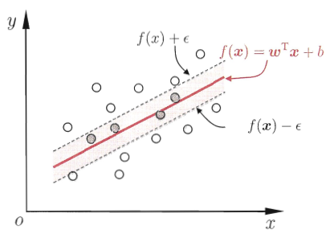
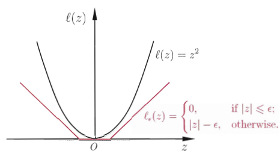

### 支持向量回归（SVR）原理介绍

------

主要参考周志华老师的《机器学习》中对应内容。

考虑回归问题，给定训练样本$D = \left\{ \left( \boldsymbol { x } _ { 1 } , y _ { 1 } \right) , \left( \boldsymbol { x } _ { 2 } , y _ { 2 } \right) , \ldots\right. ,\left( \boldsymbol { x } _ { m } , y _ { m } \right) \}$，我们希望得到如下回归模型：
$$
f ( \boldsymbol { x } ) = \boldsymbol { w } ^ { \mathrm { T } } \boldsymbol { x } + b \tag{1}
$$
使得$f(x)$和$y$尽可能接近。

传统的回归模型通常直接基于模型输出$f(x)$与真实输出$y$之间的差别来计算loss，当且仅当$f(x)$和$y$完全相同时，loss才为0。与此不同，SVR假设我们能容忍$f(x)$与$y$之间最多有$\epsilon$的偏差，即仅当$f(x)$与$y$之间的差别绝对值大于$\epsilon$时才计算loss。如下图所示，这相当于以$f(x)$为中心，构建了一个宽度为$2 \epsilon$的间隔带，若训练样本落入此间隔带，则认为是被预测正确的。

于是，SVR问题形式化为
$$
\min _ { \boldsymbol { w } , b } \frac { 1 } { 2 } \| \boldsymbol { w } \| ^ { 2 } + C \sum _ { i = 1 } ^ { m } \ell _ { \epsilon } \left( f \left( \boldsymbol { x } _ { i } \right) - y _ { i } \right) \tag{2}
$$
其中$C$为正则化系数，$\ell _ { \epsilon }$是$\epsilon$-不敏感损失函数：
$$
\ell _ { \epsilon } ( z ) = \left\{ \begin{array} { l l } { 0 , } & { \text { if } | z | \leqslant \epsilon } \\ { | z | - \epsilon , } & { \text { otherwise } } \end{array} \right. \tag{3}
$$
其函数图像为：

样本点落在$\epsilon-$间隔带中的条件为：
$$
f(x_{i})-\epsilon \leq y_{i} \leq f(x_{i})+\epsilon \tag{4}
$$
我们引入松弛变量$\xi _ { i }$和$\hat { \xi } _ { i }$（间隔带两侧的松弛程度不同），条件（4）变成：
$$
f(x_{i})-\epsilon - \hat \xi_{i} \leq y_{i} \leq f(x_{i})+\epsilon + \xi_{i} \tag{5}
$$
于是优化问题可以重写为：
$$
\begin{eqnarray}
\min _ { w , b , \xi _ { i } , \hat { \xi _ { i } } } &\quad& \frac { 1 } { 2 } \|  \boldsymbol { w } \| ^ { 2 } + C \sum _ { i = 1 } ^ { m } \left( \xi _ { i } + \hat { \xi } _ { i } \right)
\\ \text{s.t.} &\quad& f \left( x _ { i } \right) - y _ { i } \leqslant \epsilon + \xi _ { i },
\\ &\quad& y _ { i } - f \left( \boldsymbol { x } _ { i } \right) \leqslant \epsilon + \hat { \xi } _ { i },
\\ &\quad& \xi _ { i } \geqslant 0 , \hat { \xi } _ { i } \geqslant 0 , i = 1,2 , \ldots , m.
\end{eqnarray}
\tag{6}
$$
引入拉格朗日乘子$\mu _ { i } \geqslant 0 , \hat { \mu } _ { i } \geqslant 0 , \alpha _ { i } \geqslant 0 , \hat { \alpha } _ { i } \geqslant 0$，构造拉格朗日函数为：
$$
\begin{array} { l } { L ( \boldsymbol { w } , b , \boldsymbol { \alpha } , \hat { \boldsymbol { \alpha } } , \boldsymbol { \xi } , \hat { \boldsymbol { \xi } } , \boldsymbol { \mu } , \hat { \boldsymbol { \mu } } ) } \\ { = \frac { 1 } { 2 } \| \boldsymbol { w } \| ^ { 2 } + C \sum _ { i = 1 } ^ { m } \left( \xi _ { i } + \hat { \xi } _ { i } \right) - \sum _ { i = 1 } ^ { m } \mu _ { i } \xi _ { i } - \sum _ { i = 1 } ^ { m } \hat { \mu } _ { i } \hat { \xi } _ { i } } \\ { + \sum _ { i = 1 } ^ { m } \alpha _ { i } \left( f \left( \boldsymbol { x } _ { i } \right) - y _ { i } - \epsilon - \xi _ { i } \right) + \sum _ { i = 1 } ^ { m } \hat { \alpha } _ { i } \left( y _ { i } - f \left( \boldsymbol { x } _ { i } \right) - \boldsymbol { \epsilon } - \hat { \xi } _ { i } \right) } \end{array} \tag{7}
$$
令$L ( \boldsymbol { w } , b , \boldsymbol { \alpha } , \hat { \boldsymbol { \alpha } } , \boldsymbol { \xi } , \hat { \boldsymbol { \xi } } , \boldsymbol { \mu } , \hat { \boldsymbol { \mu } } )$对$\boldsymbol { w } , b , \xi _ { i }$和$\hat { \xi } _ { i }$的偏导为零，可得：
$$
\begin{eqnarray} \boldsymbol { w } & =& \sum _ { i = 1 } ^ { m } \left( \hat { \alpha } _ { i } - \alpha _ { i } \right) \boldsymbol { x } _ { i } \tag{8} \\ 0 & =& \sum _ { i = 1 } ^ { m } \left( \hat { \alpha } _ { i } - \alpha _ { i } \right) \tag{9} \\ C & =& \alpha _ { i } + \mu _ { i } \tag{10} \\ C & = &\hat { \alpha } _ { i } + \hat { \mu } _ { i } \tag{11} \end{eqnarray}
$$
将式（8）~（11）代入式（7），即可得到SVR的对偶问题
$$
\begin{aligned} \max _ { \alpha , \hat { \alpha } } & \sum _ { i = 1 } ^ { m } y _ { i } \left( \hat { \alpha } _ { i } - \alpha _ { i } \right) - \epsilon \left( \hat { \alpha } _ { i } + \alpha _ { i } \right) \\ & - \frac { 1 } { 2 } \sum _ { i = 1 } ^ { m } \sum _ { j = 1 } ^ { m } \left( \hat { \alpha } _ { i } - \alpha _ { i } \right) \left( \hat { \alpha } _ { j } - \alpha _ { j } \right) x _ { i } ^ { \mathrm { T } } \boldsymbol { x } _ { j } \\ \text { s.t. } & \sum _ { i = 1 } ^ { m } \left( \hat { \alpha } _ { i } - \alpha _ { i } \right) = 0 \\ & 0 \leqslant \alpha _ { i } , \hat { \alpha } _ { i } \leqslant C \end{aligned} \tag{12}
$$
上述过程满足KKT条件，有
$$
\left\{ \begin{array} { l } { \alpha _ { i } \left( f \left( \boldsymbol { x } _ { i } \right) - y _ { i } - \epsilon - \xi _ { i } \right) = 0 } \\ { \hat { \alpha } _ { i } \left( y _ { i } - f \left( \boldsymbol { x } _ { i } \right) - \epsilon - \hat { \xi } _ { i } \right) = 0 } \\ { \alpha _ { i } \hat { \alpha } _ { i } = 0 , \xi _ { i } \hat { \xi } _ { i } = 0 } \\ { \left( C - \alpha _ { i } \right) \xi _ { i } = 0 , \left( C - \hat { \alpha } _ { i } \right) \hat { \xi } _ { i } = 0 } \end{array} \right. \tag{13}
$$
*（这里有一个问题：式（13）中的第三行是如何通过KKT条件得到的？）*

可以看出，当且仅当$f \left( x _ { i } \right) - y _ { i } - \epsilon - \xi _ { i } = 0$时$\alpha _ { i }$能取非零值，当且仅当$y _ { i } - f \left( \boldsymbol { x } _ { i } \right) - \epsilon - \hat { \xi } _ { i } = 0$时$\hat { \alpha } _ { i }$能取非零值。换言之，仅当样本$\left( \boldsymbol { x } _ { i } , y _ { i } \right)$不落入$\epsilon-$间隔带中，相应的$\alpha _ { i }$和$\hat { \alpha } _ { i }$才能取非零值。此外，约束$f \left( \boldsymbol { x } _ { i } \right) - y _ { i } - \epsilon - \xi _ { i } = 0$和$y _ { i } - f \left( \boldsymbol { x } _ { i } \right) - \epsilon - \hat { \xi } _ { i } = 0$不能同时成立，因此$\alpha _ { i }$和$\hat { \alpha } _ { i }$中至少有一个为零。

将式（8）代入式（1），可得SVR的解：
$$
f ( \boldsymbol { x } ) = \sum _ { i = 1 } ^ { m } \left( \hat { \alpha } _ { i } - \alpha _ { i } \right) \boldsymbol { x } _ { i } ^ { \mathrm { T } } \boldsymbol { x } + b \tag{14}
$$
能使式（14）中的$\left( \hat { \alpha } _ { i } - \alpha _ { i } \right) \neq 0$的样本即为SVR的支持向量，它们必落在$\epsilon-$间隔带之外。显然，SVR的支持向量仅是训练样本的一部分，即其解仍具有稀疏性。

由KKT条件可以看出，对每个样本$\left( \boldsymbol { x } _ { i } , y _ { i } \right)$都有$\left( C - \alpha _ { i } \right) \xi _ { i } = 0$且$\alpha _ { i } \left( f \left( x _ { i } \right) - y _ { i } - \epsilon - \xi _ { i } \right) = 0$。于是，在得到$\alpha _ { i }$后，若$0 < \alpha _ { i } < C$，则必有$\xi _ { i } = 0$，进而有
$$
b = y _ { i } + \epsilon - \sum _ { i = 1 } ^ { m } \left( \hat { \alpha } _ { i } - \alpha _ { i } \right) \boldsymbol { x } _ { i } ^ { \mathrm { T } } \boldsymbol { x } \tag{15}
$$
因此，在求解式（12）得到$\alpha _ { i }$后，理论上来说，可任意选取满足$0 < \alpha _ { i } < C$的样本通过式（15）求得$b$。实践中常采用一种更鲁棒的方法：选取多个（或所有）满足条件$0 < \alpha _ { i } < C$的样本求解$b$后取平均值。

同样，我们可以在SVR中引入核函数，此时式（8）变为：
$$
\boldsymbol { w } = \sum _ { i = 1 } ^ { m } \left( \hat { \alpha } _ { i } - \alpha _ { i } \right) \phi \left( \boldsymbol { x } _ { i } \right) \tag{16}
$$
而SVR可表示为：
$$
f ( \boldsymbol { x } ) = \sum _ { i = 1 } ^ { m } \left( \hat { \alpha } _ { i } - \alpha _ { i } \right) \kappa \left( \boldsymbol { x } , \boldsymbol { x } _ { i } \right) + b \tag{17}
$$
其中$\kappa \left( \boldsymbol { x } _ { i } , \boldsymbol { x } _ { j } \right) = \phi \left( \boldsymbol { x } _ { i } \right) ^ { \mathrm { T } } \phi \left( \boldsymbol { x } _ { j } \right)$为核函数。